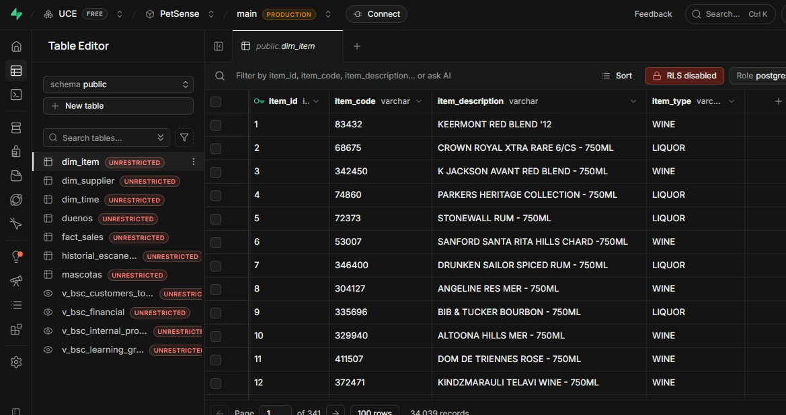
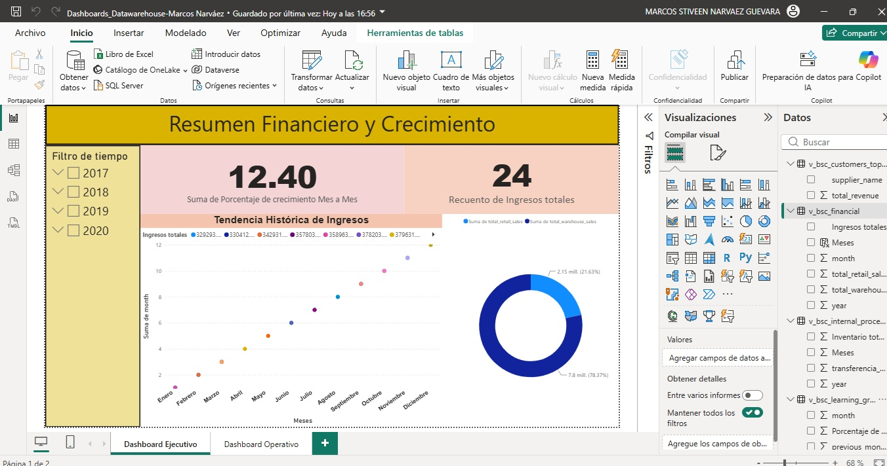
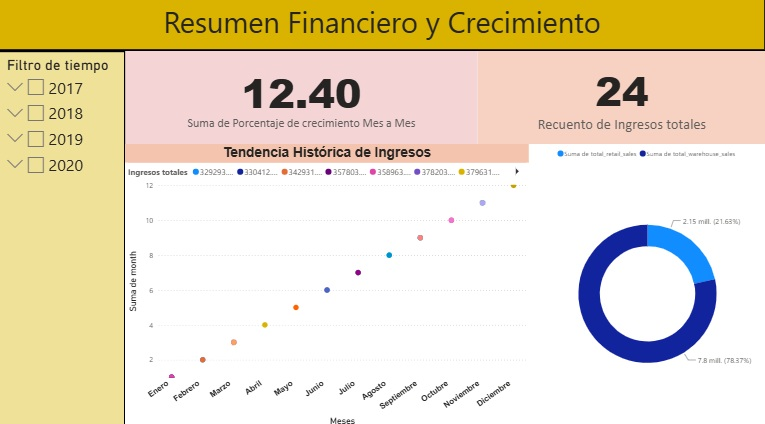
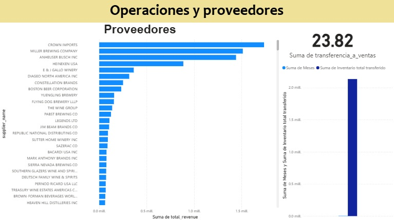

# Data Warehouse & Business Intelligence (BI) - Retail & Warehouse Sales

Este repositorio contiene la arquitectura completa, el proceso ETL y la definición del modelo analítico para un **Data Warehouse** construido sobre **PostgreSQL (Supabase)**, con el objetivo de analizar un volumen de más de 300,000 registros de ventas Retail y Mayoristas.

El proyecto está diseñado bajo un modelo dimensional (Esquema Estrella) y documentado aplicando principios de calidad de datos COBIT APO11.

---

## 💾 Dataset y Limpieza de Datos

El dataset utilizado para este proyecto fue obtenido originalmente de Kaggle:
🔗 **[Warehouse and Retail Sales Dataset](https://www.kaggle.com/datasets/lalit7881/warehouse-and-retail-sales/data)**

**Proceso de Limpieza:**
Para asegurar la calidad de la información (COBIT APO11), la data pasó por un proceso de limpieza inicial riguroso. Se eliminaron registros anómalos y aquellos que contenían columnas vacías o nulas. En la etapa de transformación (Python Pandas), se estandarizaron los tipos de datos forzando valores mixtos (como el `ITEM CODE`) a cadenas de texto estrictas para asegurar el éxito de los cruces (Joins) en el Data Warehouse.

### Diccionario de Datos (Origen)
* **YEAR:** año de la transacción.
* **MONTH:** mes de la transacción.
* **SUPPLIER:** proveedor del producto.
* **ITEM CODE:** código del producto.
* **ITEM DESCRIPTION:** descripción del producto.
* **ITEM TYPE:** tipo de producto.
* **RETAIL SALES:** ventas en tiendas (valor en dólares).
* **RETAIL TRANSFERS:** transferencias a tiendas (inventario movido logísticamente).
* **WAREHOUSE SALES:** ventas desde el almacén (posiblemente a mayoristas o para consumo propio).

---

## 🚀 Arquitectura del Proyecto

* **Origen de Datos:** Dataset CSV de Ventas (Retail y Warehouse).
* **Motor ETL:** Python (`pandas` y `SQLAlchemy`).
* **Data Warehouse:** PostgreSQL en la nube (Supabase).
* **Visualización:** Microsoft Power BI.

---

## 🗄️ Base de Datos (Supabase)

Las tablas fueron modeladas en un Esquema Estrella e implementadas en PostgreSQL.
*A continuación, una captura de las tablas y relaciones implementadas en Supabase:*



---

## 📊 Dashboard y Vistas SQL

El Data Warehouse no alimenta directamente a Power BI con tablas crudas (buena práctica de BI). Hemos implementado un modelo de **Vistas Analíticas en Base de Datos** (`sql/04_kpis_views.sql`) para que el servidor Postgres haga el procesamiento pesado, entregando métricas limpias para el Balanced Scorecard:

* **`v_bsc_financial`**: Calcula los ingresos totales mensuales sumando Retail + Warehouse.
* **`v_bsc_internal_processes`**: Mide la eficiencia logística comparando la cantidad de mercancía transferida versus la mercancía efectivamente vendida.
* **`v_bsc_customers_top_suppliers`**: Agrupa y ordena a los proveedores principales por volumen de ingresos (Ley de Pareto).
* **`v_bsc_learning_growth`**: Utiliza funciones de ventana SQL (`LAG`) para buscar en el pasado y calcular matemáticamente el porcentaje de crecimiento o decrecimiento mensual (MoM Growth %).

---

## 📈 Resultados Finales en Power BI

El reporte interactivo desarrollado en Microsoft Power BI se encuentra en este repositorio, listo para ser descargado y explorado.

📥 **[Descargar Dashboard (.pbix)](dashboards/Dashboards_Datawarehouse-Marcos%20Narv%C3%A1ez.pbix)**

*Proceso de elaboración y modelado dentro de Power BI Desktop:*


### Vista 1: Nivel Ejecutivo (Resumen Financiero y Crecimiento)


### Vista 2: Nivel Operativo (Operaciones y Proveedores)


---

## 📂 Estructura del Repositorio

```text
📁 DataWarehouse-BI/
├── 📁 dashboards/                 # Archivo .pbix listo para visualizar en Power BI
├── 📁 datasets/                   # Archivos fuente (CSV original)
├── 📁 docs/                       # Diccionario de datos y documentación de KPIs/BSC
├── 📁 etl/                        # Scripts de Python para Extracción, Transformación y Carga
├── 📁 img/                        # Capturas de pantalla y evidencias visuales
├── 📁 sql/                        # Scripts de creación de tablas, vistas y reinicio de BD
├── .env                           # Variables de entorno (ignorado en git)
├── .gitignore                     # Archivos ignorados por versionamiento
├── requirements.txt               # Dependencias (pandas, sqlalchemy, psycopg2, python-dotenv)
└── Roadmap_DataWarehouse_BI.md    # Hilo conductor y fases del proyecto
```

## 🛠️ Cómo ejecutar el ETL (Para Desarrolladores)

1. Clona el repositorio e instala las dependencias:
   ```bash
   pip install -r requirements.txt
   ```
2. Configura tu archivo `.env` en la raíz del proyecto con la variable `DATABASE_URL` apuntando a tu base de datos Supabase.
3. Asegúrate de haber ejecutado los scripts de creación de tablas y vistas ubicados en `sql/01_create_tables.sql` y `sql/04_kpis_views.sql`.
4. Ejecuta el orquestador:
   ```bash
   python etl/main.py
   ```
